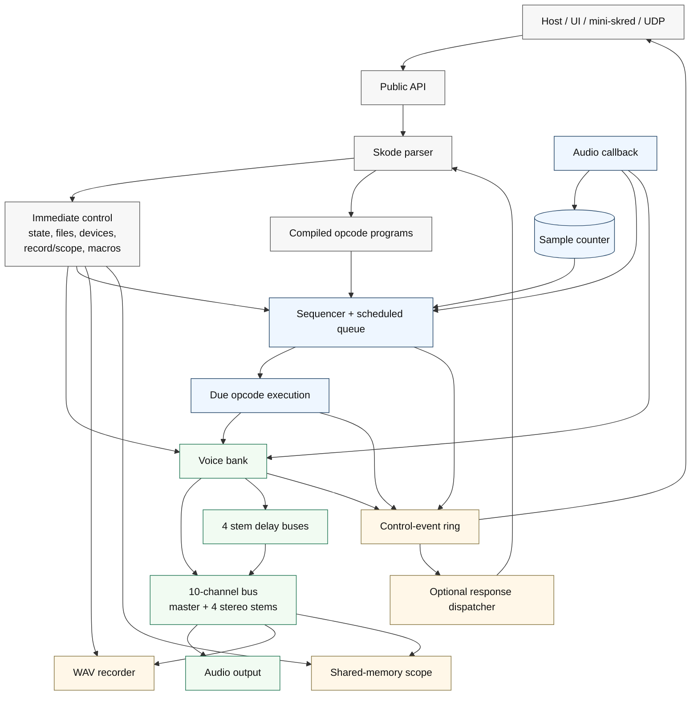
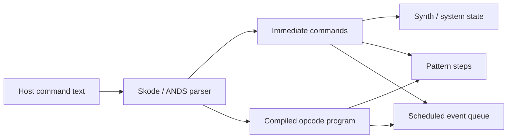
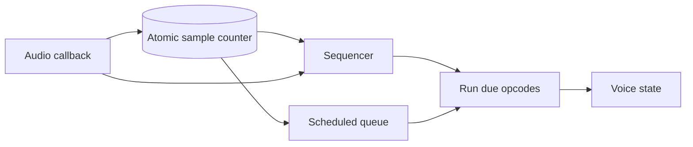
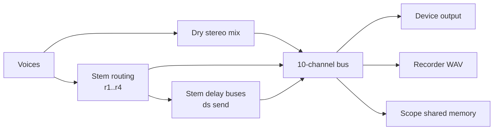
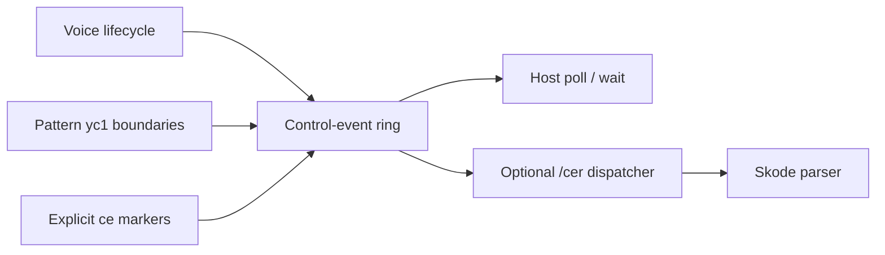

# Maxed SKRED System Diagram

## One-Page Overview

## Control Path

Text commands enter through `skred_command()` and run on the caller's control
thread. Commands that are safe for the real-time side compile into bounded
opcode programs; the audio callback never parses Skode text.

## Real-Time Path

The sequencer and scheduled queue share the sample counter. The callback splits
render blocks at event/pattern boundaries, runs due work, then renders the next
audio segment.

## Audio And Capture Path

Voices always feed the stereo master unless disconnected. `r1` through `r4`
also route voices into four stereo stems. `ds` sends a centered, non-pan-modulated
voice into the delay line for its current stem; the wet delay returns to both
the master and that stem. The record/scope bus is 10 channels: master L/R plus
four stereo stems.

## Notification Path

- Scheduled opcode events are engine work waiting to happen.
- Control-plane events are notifications after work happens: voice lifecycle,
  pattern boundaries, and explicit `ce` markers.
- Hosts consume notifications by polling or waiting on the control-event ring.
- The optional response dispatcher can consume matching events and submit bound
  Skode commands back through the control path.
