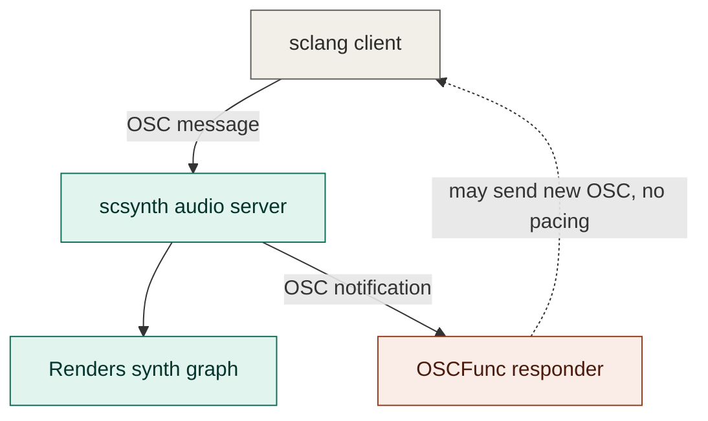
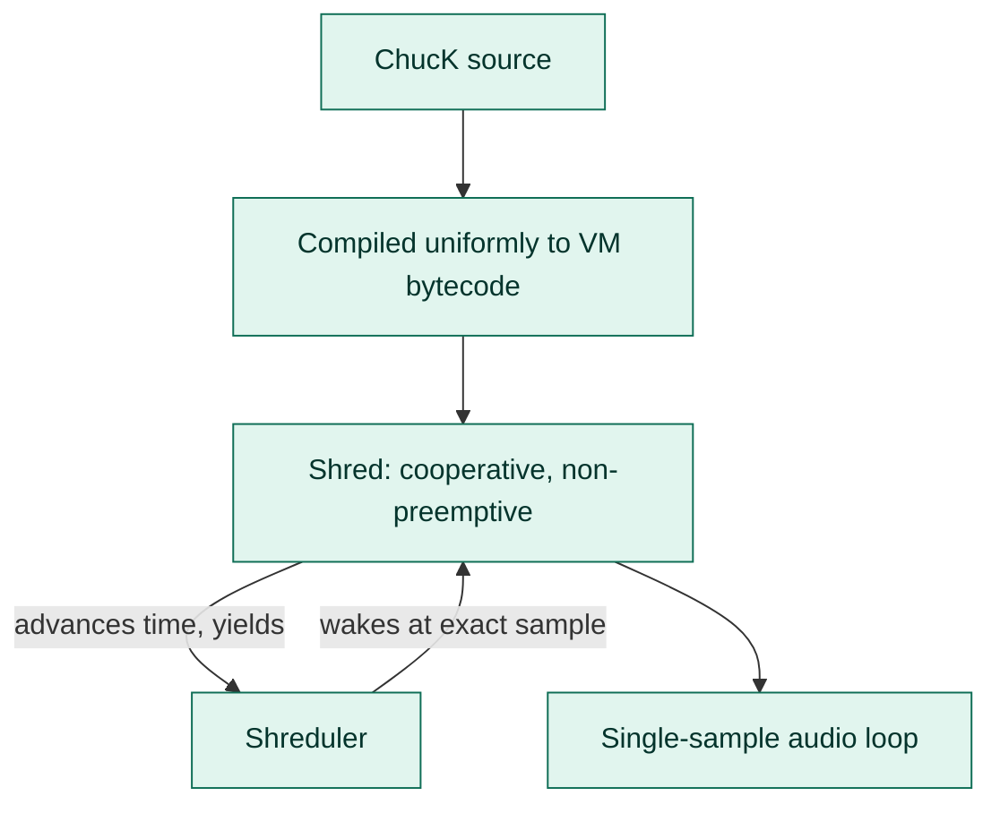
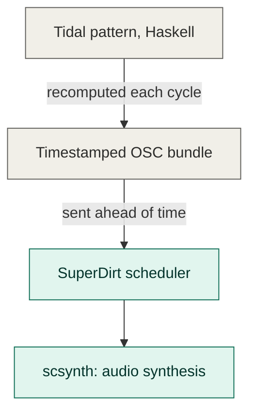
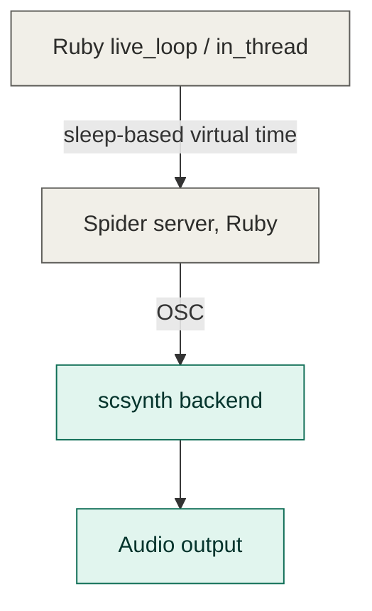
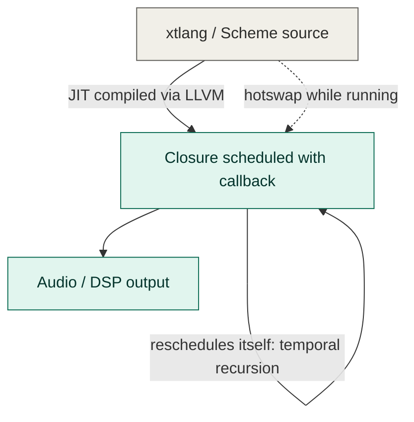
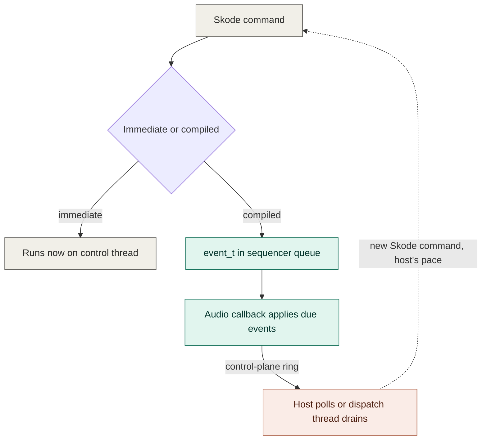

# SKRED Compared to Other Live Coding Audio Systems

This document places SKRED's architecture next to five other widely used
live coding audio systems, focused specifically on how each one gets text
into sound: where control code runs, how it's compiled or interpreted, how
time and scheduling work, and how (or whether) the engine talks back to a
host. See [ARCHITECTURE.md](ARCHITECTURE.md) and [EVENTS.md](EVENTS.md) for
SKRED's own architecture in detail; this document assumes that context.

Scope: SuperCollider, ChucK, TidalCycles, Sonic Pi, and Extempore. These
were picked for architectural contrast, not because they're the only other
systems worth knowing — Pure Data, FoxDot, Glicol, Strudel, and others are
left out for brevity.

## At a glance

| System | Control representation | Where control code runs | Time model | Host notification |
| --- | --- | --- | --- | --- |
| SuperCollider | OSC messages from any client | Separate process (`scsynth`), talks OSC | Client schedules externally, server executes on receipt | Push — `OSCFunc` responder fires on arrival |
| ChucK | Source compiled uniformly to VM bytecode | Same process as audio, cooperative "shreds" | Sample-accurate cooperative yield via the `chuck` operator on `now` | None needed — shreds handle their own timing inline |
| TidalCycles | Haskell patterns, recomputed and sent as OSC | Separate language/process (GHC) → SuperDirt (SC) | Pattern recomputed every cycle, sent as timestamped OSC bundles ahead of time | Push (OSC), but pre-scheduled so timing is decoupled from delivery |
| Sonic Pi | Ruby DSL, `live_loop`/`in_thread` | Separate server process (Ruby "Spider" server) → `scsynth` | Ruby threads with `sleep`-based virtual time | Push (OSC) to the synthesis backend |
| Extempore | Scheme / xtlang closures, JIT-compiled via LLVM | Same process, JIT-compiled at eval time | Temporal recursion — a closure reschedules itself via `callback` | None needed — the closure itself is the notification |
| SKRED | Skode text, split immediate vs. compiled | Same process, engine embedded in host | Compiled `event_t` in a sequencer queue, tempo-relative | Pull — host polls a bounded control-plane ring, or a dispatcher thread drains it |

The one-line differentiator for each: SuperCollider separates language from
engine and pushes notifications; ChucK compiles everything the same way and
never needs a host to poll; TidalCycles decouples pattern computation from
delivery timing entirely; Sonic Pi wraps SuperCollider's client/server split
in Ruby's thread model; Extempore turns scheduling itself into ordinary
recursive function calls; SKRED refuses to let anything call back into host
code from anywhere near the audio thread.

## SuperCollider

`sclang` (the client language) and `scsynth` (the audio server) are
separate processes talking Open Sound Control over a socket, even when
run on the same machine. Nothing about scsynth is specific to sclang —
any OSC-capable client can drive it, which is also how Tidal and Sonic Pi
end up using it as a backend. Client-registered `OSCFunc` responders fire
the moment a matching message arrives; there's no buffering step between
"the server sent it" and "your handler is running."

## ChucK

ChucK has no immediate/compiled split at all — every program is compiled
the same way, through the same Flex/Bison pipeline, into VM bytecode
executed by ChucK's own virtual machine. Concurrency comes from "shreds":
cooperative, non-preemptive user-level threads that only yield when they
explicitly advance time with the `chuck` operator (`=>` onto `now`). The
"shreduler" wakes shreds at the exact sample they asked for, so ordering
and timing are deterministic without any locks or semaphores. Because
shreds run inside the same VM that drives the single-sample audio loop,
there's no separate host to poll or notify — the language's timing
primitive *is* the audio-thread scheduling primitive.

## TidalCycles + SuperDirt

Tidal's own description of its job is blunt: send patterned OSC messages,
almost always to SuperDirt (a SuperCollider-based synth/sampler). The
pattern is recomputed every cycle in Haskell, then shipped as OSC bundles
carrying an explicit timestamp — either scheduled ahead of time in bursts
(`Pre BundleStamp`) or timed live minus a latency compensation value
(`Live`). Either way, SuperDirt is responsible for firing each message
accurately once it arrives; Tidal itself never touches real-time audio
and doesn't need to, since the timing contract is carried inside the OSC
bundle rather than depending on exactly when the message is delivered.

## Sonic Pi

Sonic Pi layers a Ruby DSL over the same SuperCollider backend Tidal
uses. Each `live_loop` or `in_thread` block is its own Ruby thread, using
`sleep` calls to track virtual musical time rather than wall-clock time.
The Ruby "Spider" server interprets this code and — like Tidal — talks
OSC to `scsynth` to actually make sound. This makes Sonic Pi's timing
model a hybrid: Ruby's ordinary thread scheduler decides when control
code runs, while musical timing accuracy is still ultimately delegated to
the SuperCollider backend receiving the OSC.

## Extempore

Extempore pairs a Scheme interpreter with xtlang, a statically typed Lisp
that JIT-compiles to LLVM IR at eval time — so redefining a function
recompiles and hot-swaps it while the program keeps running. Scheduling
has no separate mechanism at all: it's ordinary recursion. A function
calls `callback` with a future time and a reference to itself, the
runtime invokes it again at that time, and it can go on rescheduling
itself indefinitely — "temporal recursion." Because the closure *is* the
schedule, there's nothing for a host to poll; the tradeoff is that
heavyweight compilation happening on the same Scheme process as a running
temporal recursion can audibly pause playback, which is why Extempore's
own docs recommend running such loops in a separate process.

## SKRED

Where the others compile everything the same way (ChucK), or delegate to
an entirely separate audio process (SuperCollider, Tidal, Sonic Pi), or
turn scheduling into recursive closures (Extempore), SKRED draws one hard
line inside a single embedded engine: some commands may allocate, do I/O,
and format text, and some are compiled into fixed-size opcodes that the
audio callback can execute without ever touching the parser. Notifications
flow the same restrained way — nothing calls back into host code from near
the audio thread; the host polls a bounded ring, or a dispatcher thread
does the polling on the host's behalf, and either way the pace is chosen
by the host, not by delivery.

## What this means for adopters coming from another system

- **From SuperCollider, Tidal, or Sonic Pi:** there's no separate audio
  process to manage, no OSC transport in the default embedding path, and
  no responder callback firing on your client thread whenever it wants.
  If your mental model is "the engine calls me," rebuild it as "I ask the
  engine" — `skred_control_event_poll()` is pull, not push.
- **From ChucK:** SKRED's immediate/compiled split has no equivalent in
  ChucK, where everything compiles the same way. The thing to unlearn is
  writing schedulable Skode the way you'd write ChucK code that does
  string work or file I/O inline — in SKRED that's an immediate command
  and it will be rejected by the compiler if you try to schedule it.
- **From Extempore:** temporal recursion's "the closure is the schedule"
  elegance doesn't map onto SKRED's queue — there is no self-rescheduling
  primitive. The nearest equivalents are `eR`/`eRR` (repeat a compiled
  snapshot at an interval) and pattern playback, both of which are queue
  entries the sequencer drives, not code that calls itself.
- **Across all of them:** SKRED's `.kit`-based feature-gated builds are
  the one thing none of these five do — every other system here ships as
  one build with everything compiled in. That buys genuinely small SKRED
  builds at the cost of needing to test more than one feature
  configuration when you touch feature-gated code.
