# SKRED Compared to Other Live Coding Audio Systems

If you're evaluating whether SKRED fits your project, this document places
its architecture next to ten other widely used or notable live coding
audio systems — focused on how each one gets text into sound: where control
code runs, how it's compiled or interpreted, how time and scheduling work,
how (or whether) the engine talks back to a host, and how it's meant to be
deployed. See [ARCHITECTURE.md](ARCHITECTURE.md) and
[EVENTS.md](EVENTS.md) for SKRED's own architecture in detail; this
document assumes that context.

Scope: SuperCollider, Csound, Pure Data, ChucK, TidalCycles, Strudel, Sonic
Pi, Extempore, mimium, and NKIDO. These were picked for architectural
contrast, not because they're the only other systems worth knowing — FoxDot
and Glicol are left out for brevity.

## At a glance

| System | Control representation | Where control code runs | Time model | Host notification |
| --- | --- | --- | --- | --- |
| SuperCollider | OSC messages from any client | Separate process (`scsynth`), talks OSC | Client schedules externally, server executes on receipt | Push — `OSCFunc` responder fires on arrival |
| Csound | orc/sco text; instrument instances triggered by score events or `schedule`/`event` opcodes | Same process, embedded via the `libcsound` C API — hosts link statically or dynamically | Score events carry an explicit start-time offset (p2); `schedule` inserts new events at runtime | Push — registered C callbacks (keyboard, audio open/close) plus a two-way software bus (`chnget`/`chnset` channels) |
| Pure Data | Visual dataflow patch, not text — messages travel along connections | Standalone app by default; `libpd` embeds the identical DSP core as a C library | Logical time stamps on message cascades; `delay`/`pipe`/`metro` schedule future messages | Push — `libpd` registers receive-symbol callbacks for engine→host messages alongside host→engine sends |
| ChucK | Source compiled uniformly to VM bytecode | Same process as audio, cooperative "shreds" | Sample-accurate cooperative yield via the `chuck` operator on `now` | None needed — shreds handle their own timing inline |
| TidalCycles | Haskell patterns, recomputed and sent as OSC | Separate language/process (GHC) → SuperDirt (SC) | Pattern recomputed every cycle, sent as timestamped OSC bundles ahead of time | Push (OSC), but pre-scheduled so timing is decoupled from delivery |
| Strudel | JavaScript; Tidal's pattern language and mini-notation ported to JS | Entirely in-browser — default engine `superdough` runs in the same page, no external server required | Pattern recomputed and scheduled ahead via the Web Audio API's own clock | None needed beyond ordinary JS — the "host" is just the surrounding page |
| Sonic Pi | Ruby DSL, `live_loop`/`in_thread` | Separate server process (Ruby "Spider" server) → `scsynth` | Ruby threads with `sleep`-based virtual time | Push (OSC) to the synthesis backend |
| Extempore | Scheme / xtlang closures, JIT-compiled via LLVM | Same process, JIT-compiled at eval time | Temporal recursion — a closure reschedules itself via `callback` | None needed — the closure itself is the notification |
| mimium | Whole-file `dsp()` description, functional | Same process, own bytecode VM (not LLVM as of v2) | `@` operator — temporal recursion, same lineage as Extempore | None found equivalent to a control-plane ring — `Probe` reads as a debug tap, not an event system |
| NKIDO | Akkado source: a DAG + Strudel-style mini-notation patterns | Same process, compiled to bytecode, stack-based VM, one audio block at a time | DAG evaluated once per block in topological order; feedback is explicit delay-line nodes, never a cycle | One-way, host→engine only — named `param`/`button`/`toggle`/`dropdown` slots write into a runtime `EnvMap`; no engine→host event system found |
| SKRED | Skode text, split immediate vs. compiled | Same process, engine embedded in host | Compiled `event_t` in a sequencer queue, tempo-relative | Pull — host polls a bounded control-plane ring, or a dispatcher thread drains it |

The one-line differentiator for each: SuperCollider separates language from
engine and pushes notifications; Csound was doing embeddable-and-standalone
with real host callbacks decades before "live coding" was a named practice;
Pure Data is the one system here that isn't text at all — a visual patch,
embeddable since 2010 via `libpd`; ChucK compiles everything the same way
and never needs a host to poll; TidalCycles decouples pattern computation
from delivery timing entirely; Strudel is that same pattern language freed
from the multi-process requirement, running standalone in a browser tab;
Sonic Pi wraps SuperCollider's client/server split in Ruby's thread model;
Extempore turns scheduling itself into ordinary recursive function calls;
mimium earns live-edit continuity by proving at compile time which state
survives a whole-program recompile and physically copying it across; NKIDO
earns the same continuity per-node instead of whole-program, by giving
every DSP node a stable identity and diffing at that granularity; SKRED
refuses to let anything call back into host code from anywhere near the
audio thread.

## Deployment: embeddable, standalone, or both

Architecture aside, a practical question for anyone evaluating these
systems is simpler: can I drop this into my own application, or do I need
to run it as its own program? The answer splits these systems into three
groups, and it's not the same grouping as the scheduling comparison above.

**Standalone-first, not designed to embed.** TidalCycles requires a
Haskell/GHC runtime and a running SuperDirt (SuperCollider) process — it's
a desktop live-coding setup, not something built to compile into another
application. Sonic Pi is the same shape: a GUI, a Ruby server process, and
a SuperCollider backend, packaged as one desktop app. Extempore ships as a
standalone runtime/REPL rather than a library. SuperCollider's `scsynth`
is server-first by design — it's technically possible to link against it,
but as of 2026 that's still exploratory territory (Sam Aaron's SuperSonic
AudioWorklet prototype is a notable recent attempt), not the common path.

**Embeddable via dedicated per-host bridges.** ChucK is distributed
standalone (miniAudicle) by default, but it does have real embedding
stories — Chunity (Unity), Chunreal (Unreal, early), WebChucK (browsers),
and a handful of others. Each of these is its own engineering project
built to bridge the full ChucK VM into one specific host, rather than one
generic embedding surface that works the same way everywhere.

**Both, by design, via one generic API.** This turns out to be a longer
list than it might first appear, and a much older idea than live coding
itself. Csound's C API (`libcsound`) has explicitly documented "hosts" as
one of its two intended audiences — alongside "plugins" — since long before
most of the other systems here existed; a host links the library statically
or dynamically and drives it directly. Pure Data was built as a standalone
patching environment, but `libpd` has embedded the identical DSP core as a
C library since around 2010, shipping in a very large number of mobile
apps, games, and embedded boards. Strudel's default synth engine,
`superdough`, is published as its own npm package with no dependency on
the rest of Strudel's editor or REPL — you can `import` it directly into
any web project. mimium ships both a CLI/standalone binary and a set of
Rust crates (`mimium-lang` and friends) meant to be embedded directly in a
host Rust program. NKIDO's Cedar is described as a standalone, embeddable
C++ library targeting native apps, web (WASM), Godot, and even ESP32
microcontrollers. SKRED works the same way: `mini-skred` is a standalone
host with its own audio device selection and interactive editor, and the
exact same three-function C API (`skred_start`, `skred_command`,
`skred_stop`) is what a host application embeds directly into its own
audio callback — no bridge project, no per-host integration layer, just
one small header.

What actually sets SKRED apart within this "both" group isn't the
embeddability itself — that's well-trodden ground going back to Csound.
It's that none of Csound, Pd, Strudel, mimium, or NKIDO enforce a hard,
compiler-checked split between real-time-safe and not-real-time-safe
control code the way SKRED does. Csound and libpd both hand you host
callbacks freely and trust you not to misuse them near the audio thread;
SKRED's compiler refuses to schedule anything that could allocate or block
in the first place.

If "I want to drop this into an existing app's audio thread without
adopting a whole separate process or runtime" is a hard requirement, that
rules out TidalCycles, Sonic Pi, Extempore, and (in the common case)
SuperCollider — but leaves a genuinely crowded field of Csound, Pure Data,
Strudel, mimium, NKIDO, and SKRED all viable on that axis alone. The rest
of this document is about what further distinguishes them from each other
once that requirement is satisfied.

## SuperCollider

`sclang` (the client language) and `scsynth` (the audio server) are
separate processes talking Open Sound Control over a socket, even when
run on the same machine. Nothing about scsynth is specific to sclang —
any OSC-capable client can drive it, which is also how Tidal and Sonic Pi
end up using it as a backend. Client-registered `OSCFunc` responders fire
the moment a matching message arrives; there's no buffering step between
"the server sent it" and "your handler is running."

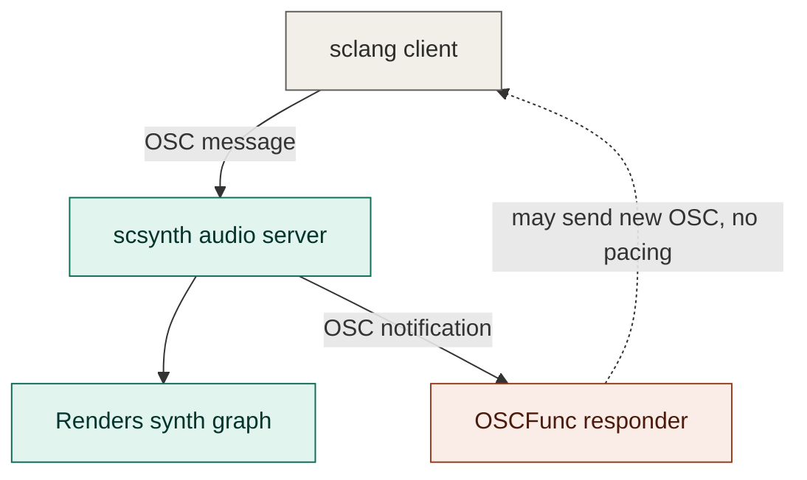

## Csound

Csound predates the term "live coding" by decades, but its API is worth
knowing about here because of how thoroughly it anticipated SKRED's
embedding story. A Csound program is text — instrument definitions in an
orchestra (`.orc`), triggered either by score events (`i` statements
carrying an explicit start-time offset) or, at runtime, by the `schedule`
and `event` opcodes, which insert new events without stopping performance.
A host embeds Csound by linking `libcsound` and driving it directly:
`compileOrc()` to add instrument definitions, `schedule()` to trigger
instances, `performKsmps()` to render. Communication runs both directions —
a "software bus" of named channels (`chnget`/`chnset`) lets host and engine
exchange control values continuously, and the host can register genuine C
callbacks (for keyboard input, opening/closing real-time audio devices,
and more) that Csound calls into directly. Csound's own API docs describe
"hosts" and "plugins" as the two audiences it was built for — the same
dual embedding posture SKRED, mimium, and NKIDO independently arrived at
much later.

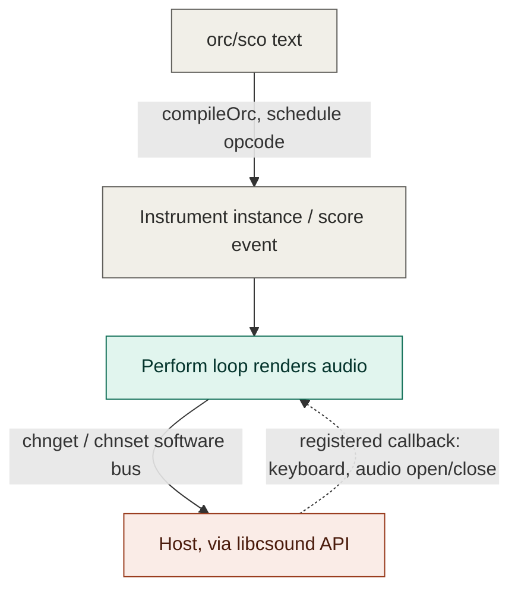

## Pure Data

Pure Data is the one system in this document that isn't text at all — a
patch is a graphical dataflow program, boxes connected by patch cords, and
messages (`bang`, `float`, `symbol`, `list`) travel along those connections
rather than being parsed from a command string. Timing is handled by
logical time stamps carried on each message cascade, independent of when
the message physically arrives, with objects like `delay`, `pipe`, and
`metro` scheduling future messages the way a text language would use a
`sleep` or `wait` primitive. Vanilla Pd runs standalone, owning its own
audio driver as the "top-level application." But `libpd` — a mature,
stable C library dating to around 2010 — embeds the exact same DSP core,
and has shipped in a large number of mobile apps, games, and embedded
boards (the Bela platform runs Pd patches via `libpd`). Host communication
is genuinely bidirectional and callback-based: client code sends messages
into named receivers inside the patch, and registers its own callbacks
bound to symbols to receive messages the patch sends back out.

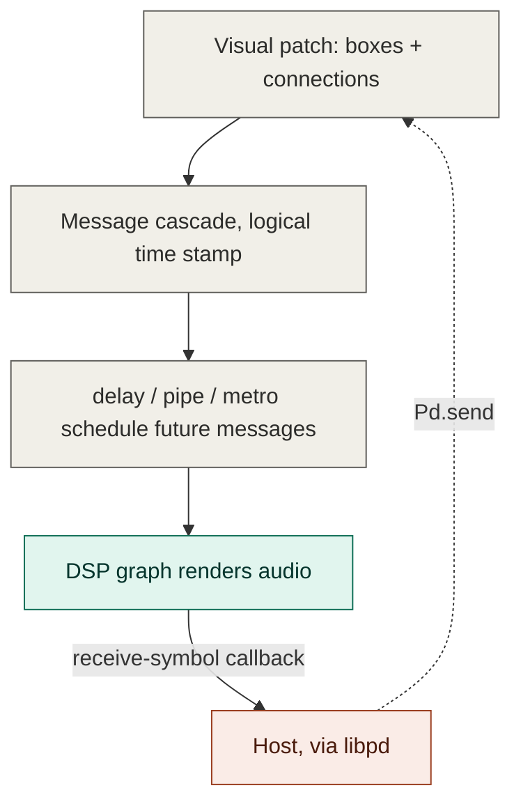

## ChucK

ChucK has no immediate/compiled split at all — every program is compiled
the same way, through the same Flex/Bison pipeline, into VM bytecode
executed by ChucK's own virtual machine. Concurrency comes from "shreds":
cooperative, non-preemptive user-level threads that only yield when they
explicitly advance time with the `chuck` operator (`=>` onto `now`). The
"shreduler" wakes shreds at the exact sample they asked for, so ordering
and timing are deterministic without any locks or semaphores. Because
shreds run inside the same VM that drives the single-sample audio loop,
there's no separate host to poll or notify — the language's timing
primitive *is* the audio-thread scheduling primitive.

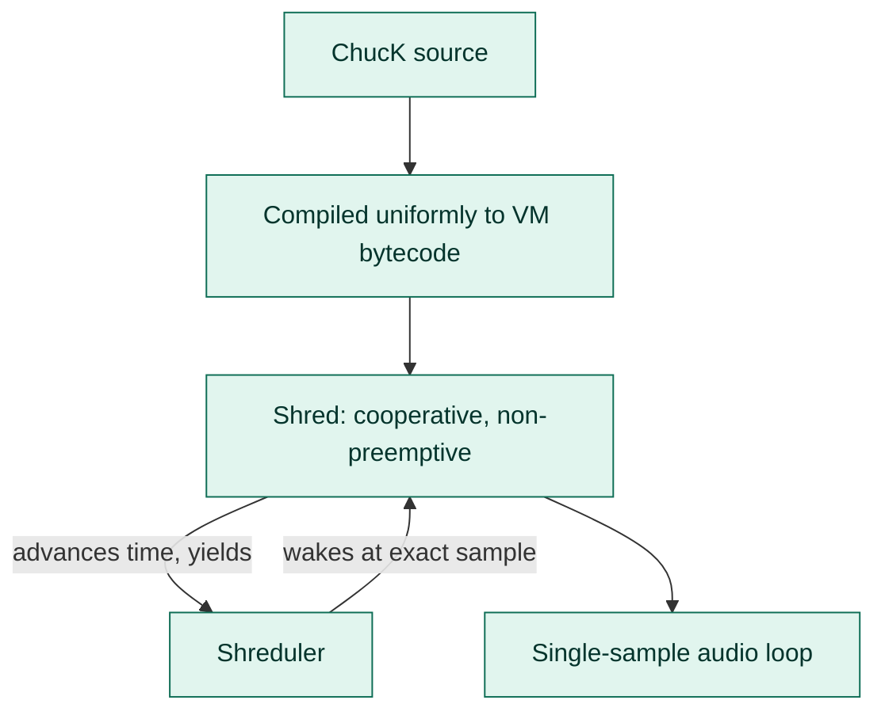

## TidalCycles + SuperDirt

Tidal's own description of its job is blunt: send patterned OSC messages,
almost always to SuperDirt (a SuperCollider-based synth/sampler). The
pattern is recomputed every cycle in Haskell, then shipped as OSC bundles
carrying an explicit timestamp — either scheduled ahead of time in bursts
(`Pre BundleStamp`) or timed live minus a latency compensation value
(`Live`). Either way, SuperDirt is responsible for firing each message
accurately once it arrives; Tidal itself never touches real-time audio
and doesn't need to, since the timing contract is carried inside the OSC
bundle rather than depending on exactly when the message is delivered.

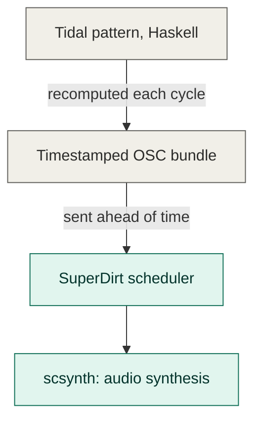

## Strudel

Strudel is TidalCycles' pattern language and mini-notation, ported to
JavaScript and run entirely in a browser tab. That single change removes
Tidal's whole cross-process dependency: there's no GHC/Haskell to install
and no separate SuperDirt/SuperCollider process to keep running alongside
it. Strudel's default sound engine, `superdough`, is a Web Audio–based
synth and sampler that runs in the same page as the pattern code, so a
pattern can be recomputed and scheduled directly against the Web Audio
API's own clock without ever leaving the browser. (Strudel can still talk
OSC to SuperDirt or MIDI to hardware if you want that instead — it's an
option, not a requirement, which is the opposite of Tidal's default.)
Because `superdough` is published as its own npm package with no
dependency on Strudel's editor or REPL, it doubles as an embedding story
for the web specifically: `import { superdough } from 'superdough'` drops
the same synthesis engine into any JavaScript project.

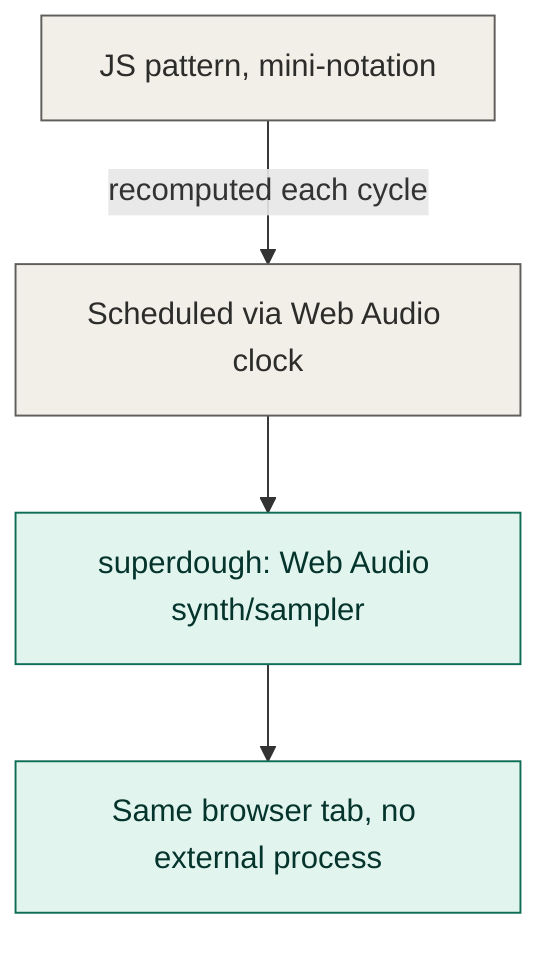

## Sonic Pi

Sonic Pi layers a Ruby DSL over the same SuperCollider backend Tidal
uses. Each `live_loop` or `in_thread` block is its own Ruby thread, using
`sleep` calls to track virtual musical time rather than wall-clock time.
The Ruby "Spider" server interprets this code and — like Tidal — talks
OSC to `scsynth` to actually make sound. This makes Sonic Pi's timing
model a hybrid: Ruby's ordinary thread scheduler decides when control
code runs, while musical timing accuracy is still ultimately delegated to
the SuperCollider backend receiving the OSC.

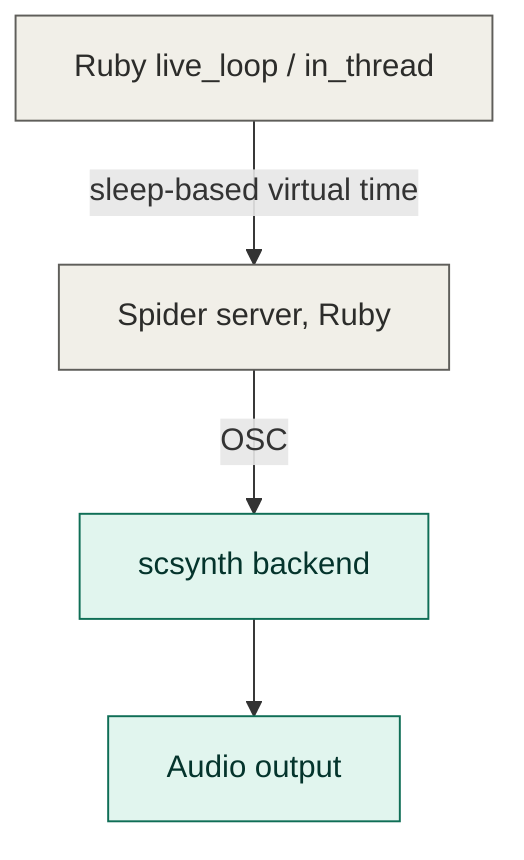

## Extempore

Extempore pairs a Scheme interpreter with xtlang, a statically typed Lisp
that JIT-compiles to LLVM IR at eval time — so redefining a function
recompiles and hot-swaps it while the program keeps running. Scheduling
has no separate mechanism at all: it's ordinary recursion. A function
calls `callback` with a future time and a reference to itself, the
runtime invokes it again at that time, and it can go on rescheduling
itself indefinitely — "temporal recursion." Because the closure *is* the
schedule, there's nothing for a host to poll; the tradeoff is that
heavyweight compilation happening on the same Scheme process as a running
temporal recursion can audibly pause playback, which is why Extempore's
own docs recommend running such loops in a separate process.

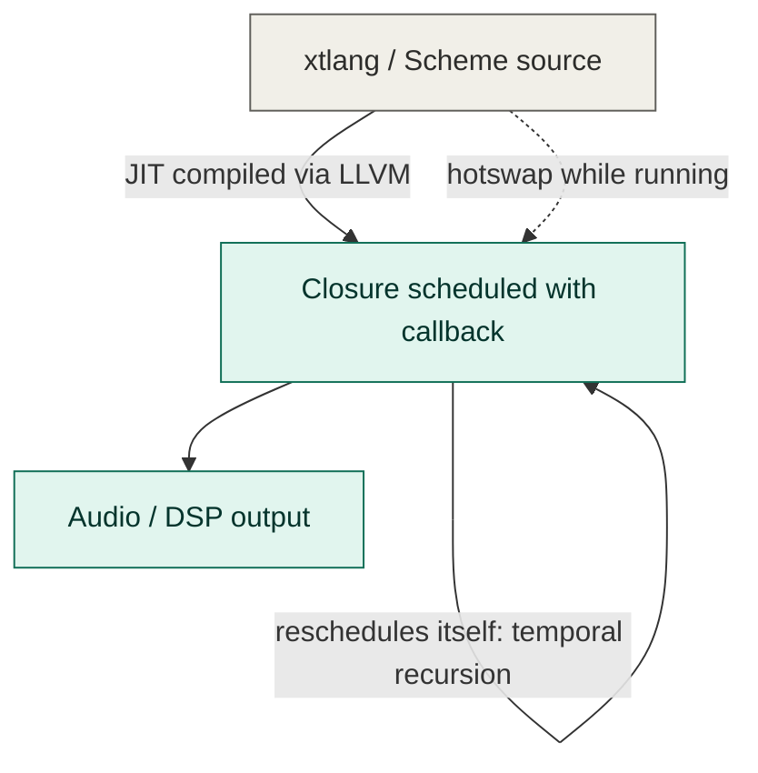

## mimium

mimium takes a completely different approach to the "edit without a click"
problem than any of the other five. There's no client/server split and no
cooperative scheduler — the entire program is a single `dsp()` function
description, written in a functional language (λmmm), compiled to mimium's
own bytecode VM. On every edit, mimium recompiles the *whole file* into a
fresh VM instance, builds a `state_tree` describing every piece of
persistent state (delay lines, the `self` feedback keyword, `mem`), diffs
that tree against the currently running VM's state, and — if the structure
matches closely enough — copies the surviving state across and swaps the
new VM in on the audio thread. Continuity across an edit isn't incidental
here, it's the explicit output of a compile-time proof. Scheduling is
handled by the `@` operator, a temporal-recursion primitive in the same
lineage as Extempore's `callback` — a function delays and re-invokes
itself rather than being placed on an external queue. mimium also has a
multi-stage compilation model (`#stage(macro)` / `#stage(main)`) that is
substantially more powerful than either of SKRED's macro systems: macro
stage code can generate structurally different `dsp()` graphs — a
different oscillator count, say — based on macro arguments, not just
substitute or inline fixed text.

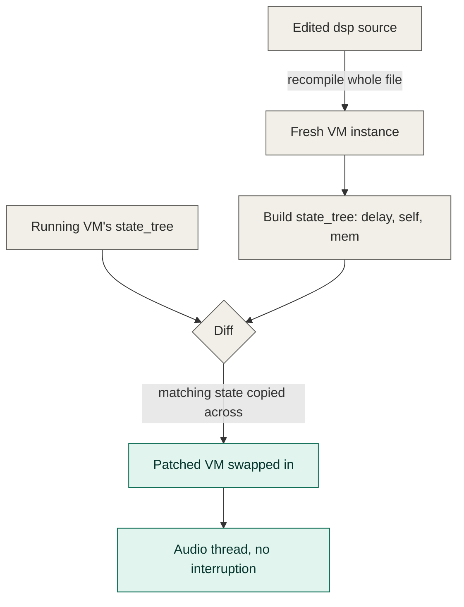

## NKIDO

NKIDO solves the same "edit without a click" problem as mimium with a
different granularity. A patch is written in Akkado — a DAG description
language with Strudel/TidalCycles-style mini-notation for patterns — and
compiles to bytecode run on a stack-based VM, one audio block at a time.
The graph is deliberately acyclic: feedback (delays, reverb tails) is
modeled as explicit delay-line nodes rather than a cycle in the graph, so
the whole DAG can always be evaluated in a single topological pass. That
constraint is also what makes NKIDO's hot-swap mechanism possible: every
node gets a **semantic ID** derived from its source position plus its
operator and constant arguments, so editing a filter's cutoff produces a
node with the same ID as before (state kept, value updated), while
changing an oscillator's waveform produces a node with a new identity
(falls back to a ~10ms crossfade). Where mimium diffs a whole-program
`state_tree` in one shot, NKIDO diffs node-by-node — a difference in
granularity more than in spirit, but it means a NKIDO edit's "blast
radius" is naturally scoped to whatever part of the graph actually
changed. Host communication runs one direction only: `param`, `button`,
`toggle`, and `dropdown` builtins register named slots in a runtime
`EnvMap` that a host UI writes into and the audio-rate graph reads from —
there's no documented engine→host event system comparable to SKRED's
control-plane ring.

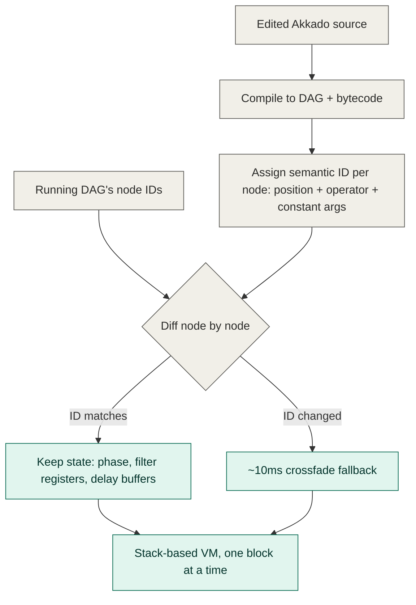

## SKRED

Where the others compile everything the same way (ChucK), or delegate to
an entirely separate audio process (SuperCollider, Tidal, Sonic Pi), or
turn scheduling into recursive closures (Extempore), SKRED draws one hard
line inside a single embedded engine: some commands may allocate, do I/O,
and format text, and some are compiled into fixed-size opcodes that the
audio callback can execute without ever touching the parser. Notifications
flow the same restrained way — nothing calls back into host code from near
the audio thread; the host polls a bounded ring, or a dispatcher thread
does the polling on the host's behalf, and either way the pace is chosen
by the host, not by delivery.

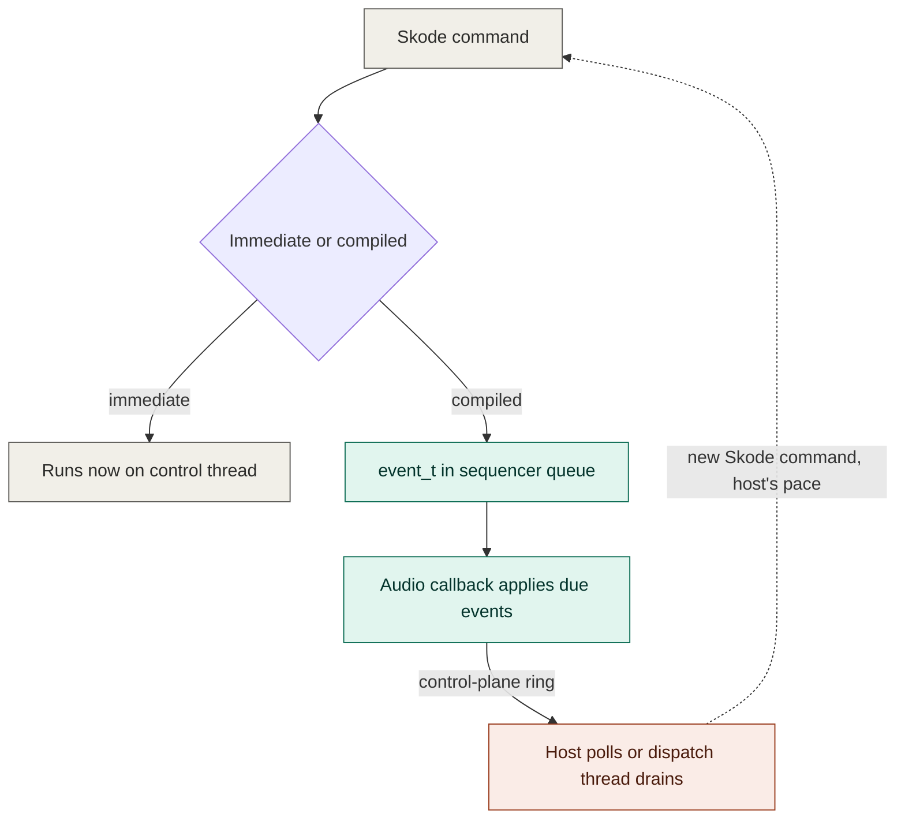

## Is SKRED useful to you?

A rough guide, based on everything above:

- **Reach for SKRED** if you want a small, dependency-light engine you can
  either run standalone or compile directly into your own application's
  audio callback with one C API and no bridge project; if real-time safety
  matters enough that you want the compiler to reject anything unsafe from
  the schedulable path rather than trusting yourself not to allocate in
  the wrong place; or if you want to inspect and reason about pending work
  as a real, persistent, taggable queue rather than a recomputed pattern
  or a self-rescheduling closure.
- **Look elsewhere** if you want automatic state preservation across a
  live edit without thinking about it (mimium's whole-program diff or
  NKIDO's per-node semantic IDs solve this more elegantly than SKRED does,
  which simply never replaces anything); if you want the expressive power
  of a general-purpose language driving synthesis in-line (ChucK,
  Extempore); if you want real host callbacks and a mature, decades-old
  ecosystem of externals/plugins and don't need SKRED's compiler-enforced
  real-time guardrails (Csound, Pure Data); if a zero-install browser tab
  is the deployment target and you don't need a compiled/embeddable C
  engine at all (Strudel); or if your project already lives in the
  SuperCollider ecosystem and OSC is the natural transport for your setup
  (SuperCollider, TidalCycles, Sonic Pi).

None of this is a ranking — these systems optimize for different things,
and SKRED's constraints (the immediate/compiled split, no self-swapping
state, poll-only host notification) are deliberate trade-offs in favor of
a small, predictable, embeddable footprint, not oversights relative to the
more structurally powerful systems above.

## What this means for adopters coming from another system

- **From SuperCollider, Tidal, Strudel, or Sonic Pi:** there's no separate
  audio process to manage, no OSC transport in the default embedding path,
  and no responder callback firing on your client thread whenever it
  wants. If your mental model is "the engine calls me," rebuild it as "I
  ask the engine" — `skred_control_event_poll()` is pull, not push.
- **From Csound or Pure Data:** the host callback you're used to
  registering — a C function Csound or `libpd` calls directly — doesn't
  exist in SKRED. There's a bounded ring and a poll function instead, and
  it's on purpose: SKRED's compiler won't let you schedule the kind of
  code that would be unsafe to run from inside a callback fired near the
  audio thread in the first place, so the ring is drained on the host's
  own schedule rather than the engine's.
- **From ChucK:** SKRED's immediate/compiled split has no equivalent in
  ChucK, where everything compiles the same way. The thing to unlearn is
  writing schedulable Skode the way you'd write ChucK code that does
  string work or file I/O inline — in SKRED that's an immediate command
  and it will be rejected by the compiler if you try to schedule it.
- **From Extempore:** temporal recursion's "the closure is the schedule"
  elegance doesn't map onto SKRED's queue — there is no self-rescheduling
  primitive. The nearest equivalents are `eR`/`eRR` (repeat a compiled
  snapshot at an interval) and pattern playback, both of which are queue
  entries the sequencer drives, not code that calls itself.
- **From mimium:** there's no whole-program recompile step to reason about
  and no `state_tree` diff/patch to worry about breaking — SKRED never
  swaps anything out, so continuity across an edit is automatic rather
  than something the compiler has to prove. The tradeoff is you also don't
  get mimium's structural power: SKRED's macro systems can't generate a
  differently shaped signal graph the way a mimium macro stage can.
- **From NKIDO:** there's no per-node identity to think about either — a
  Skode command doesn't get a semantic ID compared against a prior version
  of itself, because there is no "prior version" being replaced, only a
  queue being appended to. The instinct to ask "will this edit keep my
  filter's state or crossfade it?" doesn't apply in SKRED; the closer
  question is simply "does this voice or pattern already exist, and if so
  what am I adding to it?"
- **Across all of them:** SKRED's `.kit`-based feature-gated builds are
  the one thing none of these ten do — every other system here ships as
  one build with everything compiled in. That buys genuinely small SKRED
  builds at the cost of needing to test more than one feature
  configuration when you touch feature-gated code.
