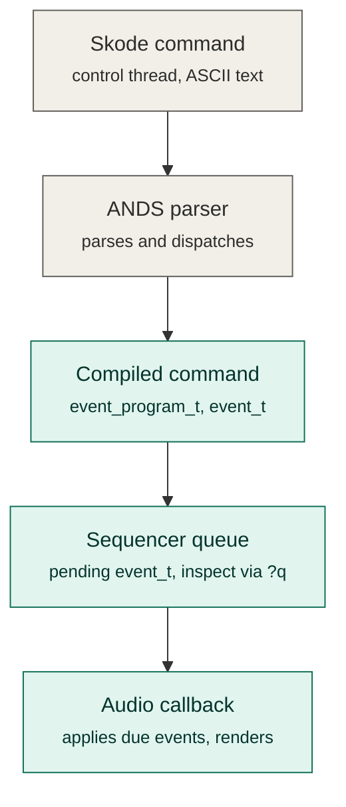

# SKRED Event Systems

SKRED has two mechanisms that both go by the name "event." They are related
but answer different questions, run on different threads, and have different
safety guarantees. This document diagrams each one separately. See
[ARCHITECTURE.md](ARCHITECTURE.md) for the surrounding design context.

## Scheduled opcode events — "what is waiting to happen?"

Skode defers, repeats, and compiled pattern operations create `event_t`
values in the sequencer queue. These are pending work for the audio engine.
Hosts can inspect them with `skred_scheduled_event_snapshot()` or `?q`.

Everything below the parser stage on this path is bounded and real-time
safe. The audio callback never parses command text — it only applies
already-compiled opcodes.



Compilation is all-or-nothing: unsupported commands do not fall back to
running parser text in the audio callback.

## Control-plane events — "what just happened?"

Voice lifecycle code, pattern boundaries, and explicit `ce` markers publish
`skred_control_event_t` records into a bounded ring after engine behavior has
already occurred. This lets a host mirror or react to engine state without
putting callbacks, I/O, or UI work on the real-time audio path.

Publication is opt-in: voice lifecycle events require `vc1` on the voice,
pattern boundary events require `yc1` on the pattern, and user events are
only ever emitted by an explicit `ce id[,a,b,c]` command.

```mermaid
graph TD
    V[Voice events<br/><small>vc1 voices only</small>] --> R[Control-plane event ring<br/><small>bounded, host drains it</small>]
    P[Pattern events<br/><small>yc1 patterns only</small>] --> R
    U[User events<br/><small>ce id command</small>] --> R

    R --> H[Host poll loop<br/><small>skred_control_event_poll&#40;&#41;</small>]
    R --> DT[Dispatch thread<br/><small>/cer 1 runs /ceb bindings</small>]

    DT -. runs bound commands on control thread .-> A[Skode command]

    classDef source fill:#faece7,stroke:#993c1d,color:#4a1b0c
    classDef ring fill:#faeeda,stroke:#854f0b,color:#412402
    classDef consumer fill:#faece7,stroke:#993c1d,color:#4a1b0c
    classDef loop fill:#f1efe8,stroke:#5f5e5a,color:#2c2c2a
    class V,P,U source
    class R ring
    class H,DT consumer
    class A loop
```



Note the dashed edge: the dispatch thread's `/ceb` bindings run back on the
control thread, not the audio thread. That's what makes it safe for a bound
response to do the things immediate commands can do — allocate, format
text, perform I/O — that would be unsafe inside the audio callback in the
diagram above.

## Voice, pattern, and user events in practice

The three producers feeding the ring in the diagram above are configured and
consumed differently. This section is the lookup table for "I want event
type X — what do I turn on, and what do I read?"

### Voice events (types 1–3)

Voice lifecycle events are emitted only for voices explicitly opted in.
They report the same thing as `?q` inspection but after the fact, and cheap
enough to leave on for voices you're actively monitoring.

| | Detail |
| --- | --- |
| Enable | `vc1` on the voice (`vc0` is the default — off) |
| Event types | `1` `SKRED_CONTROL_EVENT_VOICE_TRIGGER`, `2` `SKRED_CONTROL_EVENT_VOICE_RELEASE`, `3` `SKRED_CONTROL_EVENT_VOICE_FINISHED` |
| Responder key | the triggering voice number, or `-1` as a wildcard |
| Bind from Skode | `[command] /ceb type voice` |
| Skode example | `v0 vc1` then `[v2 l1] /ceb 1 0` runs `v2 l1` every time voice `0` triggers |
| Poll from host | `skred_control_event_poll()`, filter on `.voice` |

### Pattern events (types 5–6)

Pattern boundary events fire once per loop, not per step — they mark when
playback lands on step `0` (start) and when it reaches a stop condition
(end). Useful for host-side bar-sync without polling `?q` every tick.

| | Detail |
| --- | --- |
| Enable | `yc1` on the pattern (`yc0` is the default — off) |
| Event types | `5` `SKRED_CONTROL_EVENT_PATTERN_START`, `6` `SKRED_CONTROL_EVENT_PATTERN_END` |
| Responder key | the pattern number, or `-1` as a wildcard |
| Bind from Skode | `[command] /ceb type pattern` |
| Skode example | `y0 yc1` then `[v6 l1] /ceb 5 0` runs `v6 l1` every time pattern `0` starts |
| Poll from host | `skred_control_event_poll()`, filter on `.pattern` |

### User events (type 4)

The only producer with no separate enable switch — a `ce` command always
emits, so it doubles as an explicit host-visible marker you place anywhere
schedulable Skode text can go (defers, repeats, patterns, macros).

| | Detail |
| --- | --- |
| Enable | none — always active; emitted only by explicit `ce id[,a,b,c]` |
| Event type | `4` `SKRED_CONTROL_EVENT_USER` |
| Responder key | the `id` argument to `ce`, or `-1` as a wildcard |
| Payload | up to three numeric values `a,b,c`, meaning defined entirely by the host |
| Bind from Skode | `[command] /ceb 4 id` |
| Skode example | `[v4 l1] /ceb 4 42` then `ce 42` runs `v4 l1` |
| Poll from host | `skred_control_event_poll()`, filter on `.id` and read `.a`/`.b`/`.c` |

### A word of caution: two unrelated things are called "macro"

| | External macro | Named ANDS macro |
| --- | --- | --- |
| Syntax | `e!N` | `[name] : body ;` |
| Defined with | `[commands] e>N` | `[name] : body ;` itself |
| Stored as | numbered buffer | global name (truncated to 4 chars) |
| Executed by | the **compiler**, which inlines a numbered-buffer snapshot | cached dictionary program when `realtime`; parser text expansion when `immediate` |
| Semantics | snapshot — editing the buffer later doesn't change anything already compiled | classified on definition; redefinition replaces its status and cache |
| Inspect / remove | `e?`, `e>N` | `?m`, `/m`, `/m!` |

An ANDS macro is checked by the real compiler when defined. `?m` reports
`realtime` for a definition cached as a bounded dictionary program, or
`immediate` when it requires parser/control-thread behavior and therefore
retains text expansion. Only `realtime` named macros are legal in scheduled
positions:

```skode
[bozo] : ?ce ;
[v4 l1] /ceb 4 42
[bozo] /ceb 4 43        \ fails: ?ce is immediate-only, can't go in a /ceb response
```

```skode
[ring] : ce $$0 ;
[v4 l1] /ceb 4 43
ring 43                 \ expands to "ce 43" — legal anywhere ce 43 is, triggers the binding above
```

### Two ways to consume any of the three

- **Responder bindings via the dispatcher:** `/ceb type key` binds a
  schedulable Skode response command, `/cer 1` starts the built-in
  dispatcher thread, and everything after that runs without host code — the
  dispatcher pulls from the same ring `?ce` inspects and runs matching
  commands from its own Skode context. Good for patches that should be
  reactive on their own.
- **Polling from the host's immediate-command context:** call
  `skred_control_event_poll()` (or wait on `skred_control_event_wait_fd()` /
  `_wait_handle()` first) from your own control/UI loop and branch on
  `.type` yourself. Good when the reaction needs to touch host state — UI
  redraws, external MIDI, network — that a schedulable Skode command can't
  reach. `skred_control_dispatch_pump()` is a middle ground: keep using
  `/ceb` bindings but drive the pump from your own loop instead of the
  built-in thread.

Both consumption styles drain the same ring, so mixing them is fine as long
as you're not relying on one style to see events the other already
consumed.

## Host contract summary

- Hosts must drain the bounded ring with `skred_control_event_poll()` and
  watch the dropped-event counter. `skred_control_event_wait_fd()` /
  `skred_control_event_wait_handle()` are wake signals only, not the data.
- `skred_control_dispatch_start()` (`/cer 1`) runs bindings automatically on
  a dedicated thread; `skred_control_dispatch_pump()` lets a host service
  loop drive bindings manually instead.
- `skred_control_event_snapshot()` / `?ce` peek without consuming;
  `?ce!` explicitly discards outstanding control-plane events.
- Event type numbers are the public `SKRED_CONTROL_EVENT_*` enum:
  `1` trigger, `2` release, `3` finished, `4` user, `5` pattern start,
  `6` pattern end.
- The `event` `tag` field is provenance/cancellation metadata from scheduled
  work — it is not a response-binding key. Bindings match on event type plus
  `voice`, `pattern`, or user `id`.
